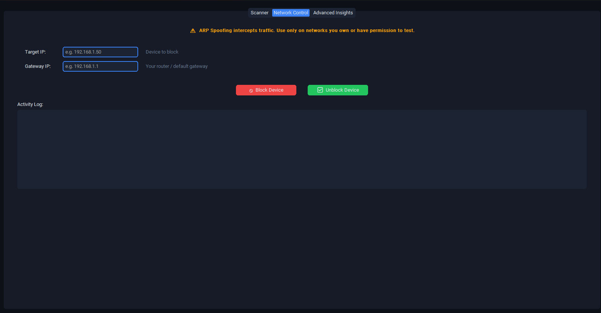

# 👻 Ghost Sentinel
**Advanced Network Security Monitor & Rogue Gateway Detector**

Ghost Sentinel is a Python-based tool designed for security researchers to monitor local network traffic, detect unauthorized gateway devices, and perform passive device fingerprinting.

## 🛡️ Recent Updates (v1.0 - Security & Stability Patch)

In this version, I focused on hardening the core engine and solving network persistence issues:

* **Hardened Restoration Logic:** Implemented a **Gratuitous ARP** mechanism. Upon exit, the tool now broadcasts 7 corrective packets at 400ms intervals to force-refresh the ARP cache of the target and gateway, ensuring **instant** network recovery.
* **Cache Persistence Fix:** Resolved bugs where target devices would remain disconnected after the attack stopped. The cleanup sequence is now more aggressive and reliable.
* **Security Audited:** The entire codebase (1500+ lines) has been scanned using **Bandit Static Analysis**. Fixed potential subprocess vulnerabilities and improved exception handling.
* **Optimized Performance:** Refined packet-sending frequency to maintain stability and prevent unintended network congestion (DoS).


##⚠️ Important Note for Existing Users:
If you are upgrading from a pre-release version, please manually delete the ghost_sentinel_data.json file before running v1.0 to avoid database conflicts and ensure the new security logic applies correctly.


## 🚀 Key Features
* **Rogue Gateway Detection:** Identifies unauthorized routers or gateways within the network.
* **ARP Spoofing Protection:** Monitors for suspicious ARP behavior to prevent MITM attacks.
* **Passive Fingerprinting:** Analyzes network traffic to identify connected devices without active scanning.
* **Modern GUI:** Built with `CustomTkinter` for a sleek, dark-themed security dashboard.

## 🛠️ Tech Stack
* **Language:** Python 3.x
* **Packet Engine:** Scapy
* **Frontend:** CustomTkinter
* **Environment:** Tested on Kali Linux & Windows 11

## 📂 Installation
1. Clone the repository:
   ```bash
   git clone [https://github.com/Revenge8/Ghost-Sentinel.git](https://github.com/Revenge8/Ghost-Sentinel.git)
   cd Ghost-Sentinel
   pip install -r requirements.txt
   python Ghost_sentinel.py
  ### 🚧 Status
This project is currently a Work in Progress. I am actively refining the detection algorithms and expanding the OUI database for better fingerprinting.
   This project is currently a Work in Progress. I am actively refining the detection algorithms and expanding the OUI database for better fingerprinting.
## 📸 Screenshots



